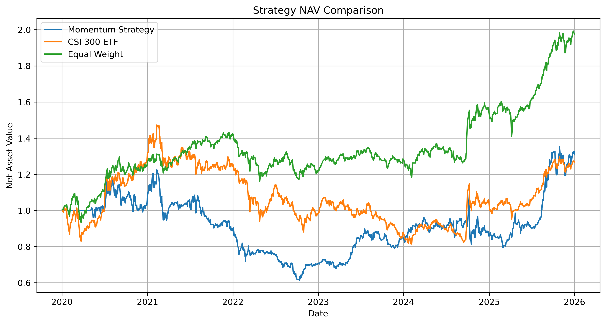
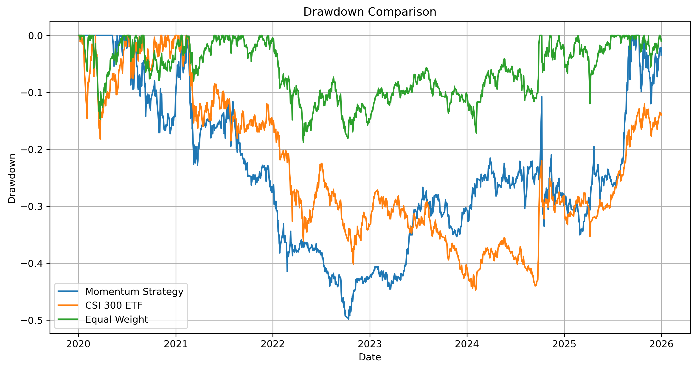

# 沪深ETF动量轮动策略回测系统

基于 A 股/美股/商品/债券多类资产的动量因子轮动策略回测框架，支持参数敏感性分析与绩效评估。

## 概述

本系统从东方财富接口获取 8 只跨市场 ETF 的历史日线数据，构建了一个**月频调仓、动量择优**的量化轮动策略，并对其进行了完整的回测与绩效评估。

核心思想：每月末计算每只 ETF 过去 N 个交易日的累计收益率（动量因子），选涨幅最高的 Top-K 只 ETF 等权持有，下月执行。

## 资产池

覆盖 4 个资产类别、共 8 只 ETF：

| 类别     | ETF 名称   | 代码    |
| -------- | ---------- | ------- |
| A 股大盘 | 沪深300ETF | 510300  |
| A 股中盘 | 中证500ETF | 510500  |
| A 股成长 | 创业板ETF  | 159915  |
| A 股小盘 | 中证1000ETF| 512100  |
| 商品     | 黄金ETF    | 518880  |
| 美股     | 纳指ETF    | 513100  |
| 美股     | 标普500ETF | 513500  |
| 债券     | 国债ETF    | 511010  |

## 依赖

- Python 3.8+
- [akshare](https://github.com/akfamily/akshare) — 金融数据接口
- pandas / numpy — 数据处理
- matplotlib — 可视化

安装依赖：

```bash
pip install akshare pandas numpy matplotlib
```

## 使用方式

克隆后直接运行主脚本：

```bash
python momentum_backtest.py
```

脚本会自动完成以下流程：
1. 下载 8 只 ETF 的日线数据（前复权）
2. 计算动量因子并生成持仓信号
3. 执行回测并计算净值
4. 输出绩效指标与对比图表
5. 运行参数敏感性分析
6. 保存结果文件

## 策略逻辑

```
每月末 → 计算每只ETF过去N日收益率 → 选涨幅最高的Top-K只 → 持有至下月末
```

- **动量周期 (lookback)**：默认 60 个交易日
- **调仓频率**：每月最后一个交易日
- **持仓数量 (top_n)**：默认选 1 只（全仓）
- **防未来函数**：动量信号往后平移 1 个交易日，用昨日持仓买今日收益

## 回测结果

运行后输出三类对比曲线与指标表。

### 净值曲线



**动量轮动策略（默认参数 lookback=60, top_n=1）** vs **沪深300ETF（基准）** vs **ETF等权组合（等权基准）**

### 回撤曲线



### 绩效指标

| 指标 | 动量轮动策略 | 沪深300ETF | ETF等权组合 |
| --- | ----------- | ---------- | ---------- |
| 年化收益率 | 4.76% | 4.17% | 12.49% |
| 年化波动率 | 24.76% | 20.87% | 14.41% |
| 夏普比率 | 0.19 | 0.20 | 0.87 |
| 最大回撤 | -49.82% | -44.75% | -18.82% |
| Calmar 比率 | 0.10 | 0.09 | 0.66 |
| 日胜率 | 48.42% | 49.45% | 53.44% |
| 累计收益率 | 30.78% | 26.57% | 97.23% |

> 注：默认参数为动量周期 60 日、持仓 1 只。从数据来看，默认参数下策略表现一般，参数敏感性分析表明优化参数可显著提升效果。

## 参数敏感性分析

测试 9 种参数组合（动量周期 × 持仓数量），按夏普比率降序排列：

| 动量周期 | 持仓数量 | 年化收益率 | 年化波动率 | 夏普比率 | 最大回撤 | Calmar 比率 | 日胜率 | 累计收益率 |
| ------- | ------- | --------- | --------- | ------- | ------- | ---------- | ----- | --------- |
| 120 | 3 | 10.76% | 15.13% | **0.71** | -23.04% | 0.47 | 49.07% | 80.41% |
| 20 | 3 | 10.87% | 17.57% | **0.62** | -26.01% | 0.42 | 50.93% | 81.44% |
| 120 | 2 | 9.31% | 17.26% | **0.54** | -17.49% | 0.53 | 47.90% | 67.16% |
| 20 | 2 | 9.45% | 20.09% | **0.47** | -34.75% | 0.27 | 50.38% | 68.46% |
| 20 | 1 | 11.57% | 25.23% | **0.46** | -33.96% | 0.34 | 48.80% | 88.16% |
| 120 | 1 | 8.05% | 21.79% | **0.37** | -26.35% | 0.31 | 47.15% | 56.36% |
| 60 | 3 | 3.91% | 17.38% | **0.22** | -35.54% | 0.11 | 51.34% | 24.77% |
| 60 | 1 | 4.76% | 24.76% | **0.19** | -49.82% | 0.10 | 48.38% | 30.78% |
| 60 | 2 | 0.46% | 20.46% | **0.02** | -41.10% | 0.01 | 49.14% | 2.68% |

**分析结论：**
- **最佳组合**：动量周期 120 日 + 持仓 3 只（夏普比率 0.71，年化 10.76%，最大回撤 -23.04%）
- **共同规律**：动量周期越长（120日 > 60日 > 20日）、持仓越分散（3只 > 2只 > 1只），策略的夏普比率和回撤控制普遍更好
- 默认参数（60日+1只）在所有组合中表现较落后，建议优化默认参数

## 输出文件

```
results/
├── figures/
│   ├── nav_curve.png          # 净值曲线对比图
│   └── drawdown_curve.png     # 回撤曲线对比图
└── tables/
    ├── performance_metrics.csv    # 绩效指标表
    └── parameter_analysis.csv     # 参数敏感性分析表
```

## 待优化方向

- [ ] 加入交易成本（滑点、佣金）
- [ ] 增加更多风险指标（下行波动率、Sortino 比率）
- [ ] 样本外测试 / 滚动回测
- [ ] 更多动量定义方式（动量分数、风险调整动量）
- [ ] 增加止盈止损逻辑
